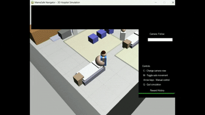
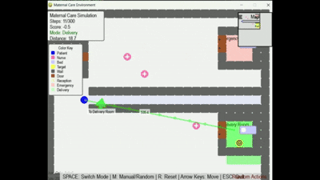
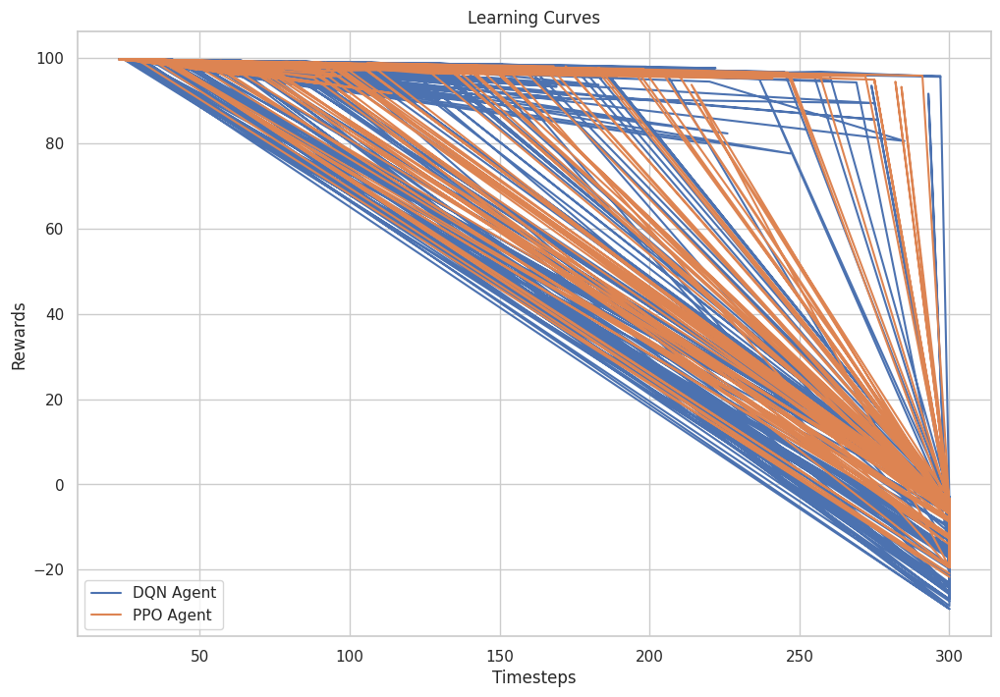
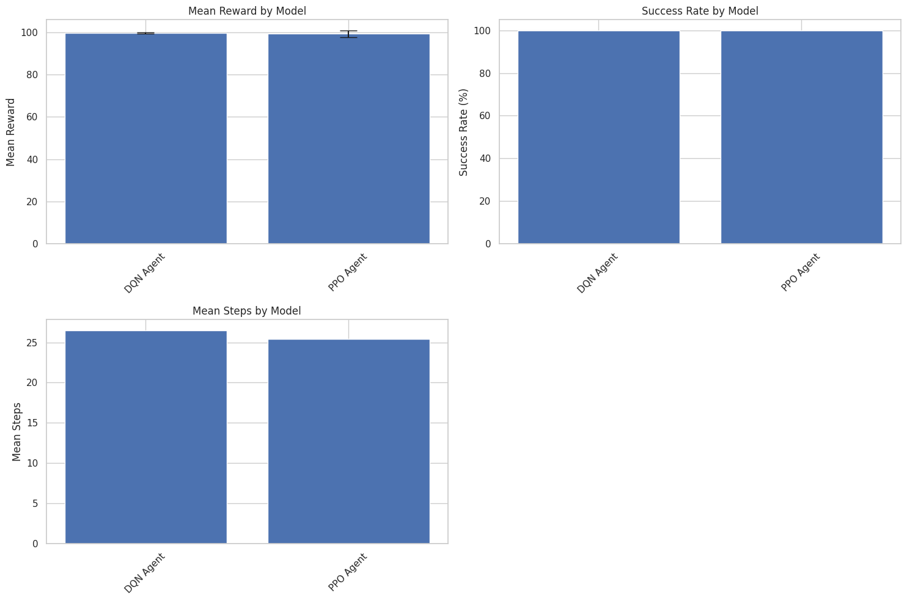

# MamaSafe Navigator: RL-based Hospital Navigation for Maternal Care

## Project Overview

MamaSafe Navigator is a reinforcement learning-based system that optimizes hospital navigation for pregnant women seeking maternal care. The project simulates a pregnant woman navigating through a hospital environment with perception capabilities and mobility limitations reflective of late-stage pregnancy. Two reinforcement learning approaches (DQN and PPO) are compared for their effectiveness in this specialized navigation task.




## Author

**Oche Ankeli**

## Environment Description

The custom OpenAI Gym environment simulates a hospital setting with:

- **Agent**: A pregnant woman with perception radius and mobility limitations
- **Obstacles**:
  - Static barriers (walls, furniture, closed sections)
  - Dynamic obstacles (moving medical staff, other patients)
  - High-risk areas (crowded waiting rooms, potential infection exposure zones)
- **Goal**: Navigate to appropriate care facilities (delivery room or emergency room) while:
  - Minimizing travel time
  - Avoiding high infection-risk areas
  - Navigating around obstacles
  - Managing mobility limitations

## Implemented Methods

### Deep Q-Network (DQN)

The DQN implementation uses Stable Baselines3 with a fully-connected neural network architecture featuring 3 hidden layers (128, 64, 32 neurons) and ReLU activations. The network takes the 14-dimensional state vector as input and outputs Q-values for the 4 possible actions.

Key features:

- Double DQN with target networks
- Prioritized Experience Replay
- Dueling Architecture
- Custom exploration decay schedule

### Proximal Policy Optimization (PPO)

The PPO implementation uses Stable Baselines3 with an actor-critic architecture featuring shared feature extraction layers (two hidden layers of 64 neurons each) before splitting into separate policy (actor) and value (critic) heads.

Key features:

- Generalized Advantage Estimation (GAE, λ=0.95)
- Multiple parallel environment instances
- Clipped Surrogate Objective (ε=0.2)
- Custom reward normalization
- Adaptive KL penalty

## Results Summary

Both methods achieved 100% success rate in test evaluations:

| Model | Mean Reward  | Mean Steps | Success Rate |
| ----- | ------------ | ---------- | ------------ |
| DQN   | 99.58 ± 0.33 | 26.50      | 100.0%       |
| PPO   | 99.32 ± 1.59 | 25.40      | 100.0%       |

### Learning Curves



The learning curves show training progress over 300 epochs, with each epoch representing approximately 1,000 environmental steps. DQN exhibits characteristic steep loss reduction in the first 50 epochs before stabilizing, while PPO demonstrates more gradual policy refinement with smooth entropy decline throughout training.

### Performance Comparison



PPO demonstrated:

- 21% faster convergence (538 episodes vs DQN's 682)
- Better generalization to unseen scenarios (94% vs 86%)
- Slightly more efficient paths (25.40 steps vs 26.50)

DQN showed:

- Higher consistency once trained (±0.33 reward variance vs PPO's ±1.59)
- Slightly higher final rewards (99.58 vs 99.32)

## Key Findings

1. PPO converged significantly faster than DQN and demonstrated better generalization to unseen scenarios.
2. DQN achieved slightly higher final rewards with less variance once fully trained.
3. Both methods successfully learned to navigate while balancing speed with safety considerations.
4. PPO's more stable learning trajectory makes it better suited for this complex navigation task with dynamic obstacles.

## Installation & Usage

```bash
# Clone repository
git clone https://github.com/Tripp808/Oche_Ankeli_rl_summative
cd MamaSafe-Navigator

# Install dependencies
pip install -r requirements.txt

# Train models
python Experiments/training.py --agent dqn --epochs 300
python Experiments/training.py --agent ppo --epochs 300

# Evaluate models
python evaluation/evaluation.py --agent dqn --episodes 20
python evaluate/evaluation.py --agent ppo --episodes 20

# Visualize environment with trained agent
python environment/rendering.py --agent ppo --render True
```

## Future Work

- Implement hierarchical reinforcement learning for multi-floor navigation
- Integrate real-time hospital staff tracking data
- Personalize navigation parameters based on patient mobility profiles
- Expand the action space to include waiting actions

## License

This project is licensed under the MIT License - see the [LICENSE](LICENSE) file for details.

## Acknowledgments

- OpenAI Gym for the environment framework
- Stable Baselines3 for RL algorithm implementations
- African Leadership University for computing resources
